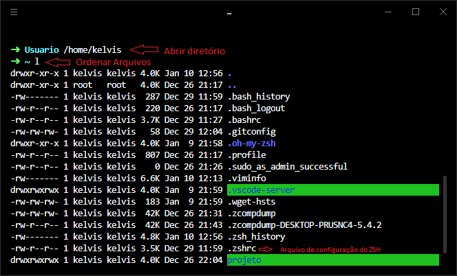
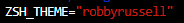

# Desafios Aula 001 :books:

### :green_book: Básico

> O primeiro desafio consiste em alterar o tema padrão do **ZSH**.

Para alterar o tema consiste nos seguintes passos:

1. Abrir o diretório que está o arquivo **_.zshrc_**
    

2. Abrir o arquivo de configuração do **ZSH**

   ```
   vim .zshrc
   ```

3. Alterar tema **_(alterar o ZSH_THEME)_** como padrão vem o tema **robbyrussel** vamos mudá-lo para o tema **bira**

   - Para alterar/inserir caracteres no vim é preciso apertar a tecla `i` em seguida vá até o `ZSH_THEME`:

     

   - Altere para o tema escolhido

     

   - Depois que alterar o tema, para sair do vim e salvar as informações é preciso apertar a tecla `ESC` (para sair) em seguida o comando `:x` (para salvar)

   - Por fim, para que as mudanças passam a ser reconhecidas você pode ou fechar e abrir novamente o terminal ou apenas atualizar o arquivo de configuração **.zshrc**

     


### :orange_book: Intermediário
> O segundo desafio consiste fazer anotações com outros comandos markdown


| Comando  | Resultado                      | Descrição         |
| :-------- | :------------------------------- | :------------ |
|  \*\*argumento\*\* |  **argumento**     |  Palavra com dois asteriscos no começo e fim, faz com que o argumento dentro fique negrito        |
| \_\_argumento\_\_ | __argumento__ | Um outra maneia de declarar o negrito |
| \*argumento\*  | *argumento*      | Palavra com um asterisco no começo e fim, faz com que o argumento dentro fique itálico      |
| \_argumento\_  | _argumento_      | Outra maneira de declarar o itálico   |
| [texto do link](o link) | [Acessar o Google](https://www.google.com)     | Entre __[]__ coloca-se o titulo do link, em seguido do __()__ que é colocado o link      |
| \<https://exemplo.com\> | <https://exemplo.com>     | Outra maneira de inserir um link, mas nesse caso é link direto sem descrição      |
|  |    | Entre **![]** vai o titulo da imagem seguido do **()** que vai o link      |
| > Este é um _blockquote_. | <blockquote> Este é um _blockquote_ </blockquote>    | Só usar a seta *>* depois o paragrafo do blockquote     | 
